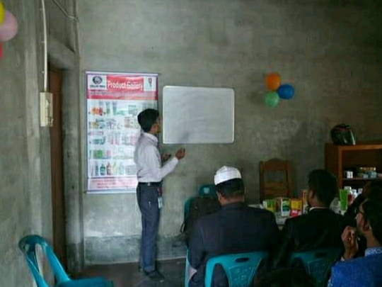

<html lang="en">
  <head>
    <!-- Required meta tags -->
    <meta charset="utf-8">
    <meta name="viewport" content="width=device-width, initial-scale=1">

    <!-- Bootstrap CSS -->
    <link href="https://cdn.jsdelivr.net/npm/bootstrap@5.1.0/dist/css/bootstrap.min.css" rel="stylesheet" integrity="sha384-KyZXEAg3QhqLMpG8r+8fhAXLRk2vvoC2f3B09zVXn8CA5QIVfZOJ3BCsw2P0p/We" crossorigin="anonymous">

    <title> Alamin profile </title>
  </head>
  <body>
    
<ul class="nav nav-tabs sticky-top " id="myTab" role="tablist">
  <li class="nav-item" role="presentation">
    <a class="nav-link active" id="home-tab" data-toggle="tab" href="#home" role="tab" aria-controls="home" aria-selected="true">Home</a>
  </li>
  <li class="nav-item" role="presentation">
    <a class="nav-link active" id="profile-tab" data-toggle="tab" href="#profiles" role="tab" aria-controls="profile" aria-selected="true">Profile</a>
  </li>
  
<li class="nav-item" role="presentation">
    <a class="nav-link active" id="contact-tab" data-toggle="tab" href="#Educations" role="tab" aria-controls="contact" aria-selected="true">Education </a>
  </li>
  

</ul>

  
...

  
 

  
 

  

    <button type="button" data-bs-target="#carouselExampleIndicators" data-bs-slide-to="0" class="active" aria-current="true" aria-label="Slide 1"></button>
    <button type="button" data-bs-target="#carouselExampleIndicators" data-bs-slide-to="1" aria-label="Slide 2"></button>
    <button type="button" data-bs-target="#carouselExampleIndicators" data-bs-slide-to="2" aria-label="Slide 3"></button>
  

  

    

      
    

    

      
    

    

      
    

  

  <button class="carousel-control-prev" type="button" data-bs-target="#carouselExampleIndicators" data-bs-slide="prev">
    
    Previous
  </button>
  <button class="carousel-control-next" type="button" data-bs-target="#carouselExampleIndicators" data-bs-slide="next">
    
    Next
  </button>

  

  <h1 class="display-4"> Welcome to my website. </h1>
  
I want to be a curious  Programmer,, Speaker, runner and a failed comedian.

  

  
 Hi i'm ALAMIN. I live in Bangladesh.  My district Jessore and Thana Bagharpara, I study in 12th class.  I want to be a programmer in the future and work for the development of the country.
 

  <button><a href="https://www.linkedin.com/in/md-alamin-720b41214" width="300 " alt=" LinkedIn "  Target="_blank">Learn more  </a> </button>

  

       

  

  

    
    

      <h5 class="card-title">Travaling</h5>
      
I like to travel.  Everyone should visit the world.  God the Almighty has made the earth very beautiful.  I am fascinated by the beauty of the world.

      
<small class="text-muted">Last updated 3 mins ago</small>

    

  

  

    
    

      <h5 class="card-title"> Playing</h5>
      
It is our daily routine to play sports to keep the mind well. If the mind is good, all work is perfected.  I want to keep a good mind through sports.

      
<small class="text-muted">Last updated 3 mins ago</small>

    

  

  

    
    

      <h5 class="card-title">Speaking</h5>
      
Talking in front of people is important. I always try to present myself and accept everyone as a good friend. Each of us should do public speaking.

      
<small class="text-muted">Last updated 3 mins ago</small>

    

  

  

  

    Education 
  

  

    <h5 class="card-title"> </h5>
    
Currently I am studying in Intermediate, in future I want to get a degree from Dhaka University and take BCS exam.

    <a href="#" class="btn btn-primary">Go somewhere</a>
  

     
    
    

  

 <h4> SONG </h4>
  

  

    <h5 class="card-title"> </h5>
    
 
 
    <audio controls Autoplay loop  >
         
            <source  src=" Sajibon diya .mp3 " type="audio/mpeg ">
          
        </audio>
 

    <a href=" https://www.facebook.com/Alaminsr599 " > <button>Go to my Facebook id  </button> </a>
  

     

  

  <button> Contact me  </button>
  

  <ul class="list-group list-group-flush">
    <li class="list-group-item">phone Number: 01751893994 </li>
   
    <li class="list-group-item">Email: alaminsr599@gmail.com</li>
    
  </ul>

    
        
     <video controls  autoplay >
         
            <source  src="jibon.mp4" type="video/mp4 ">
          
        </video> 

    <!-- Optional JavaScript; choose one of the two! -->

    <!-- Option 1: Bootstrap Bundle with Popper -->
    

    <!-- Option 2: Separate Popper and Bootstrap JS -->
    <!--
    
    
  -->

    
